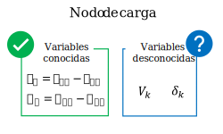
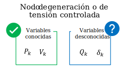

    

    

## Clasificación de los nodos para el estudio de flujos de potencia

Keywords: `Busbars` `Power flow` `Classification` `PV` `PQ` `Slack`

### Requerimientos 

* Lectura de referencias a pie de página
* [Sistema de potencia](https://es.wikipedia.org/wiki/Sistema_el%C3%A9ctrico_de_potencia)

### Necesidad de clasificar los nodos en el sistema de potencia

Como se dijo en la [Actividad 1](../01.01.Equations/Readme.md), cada uno de los nodos del sistema de potencia se asocia con cuatro variables.

Para reducir el número de incógnitas en el sistema, se opta por identificar las variables conocidas en cada nodo dependiendo de los elementos que estén conectados y su comportamiento.

En general, se identifican tres tipos de nodos en la red que se describen a continuación.

### Nodos de carga

Los nodos que no tienen generación, se pueden identificar como nodos de carga. 

En estos la potencia generada es nula y se tiene conocimiento de los valores reales o aproximados de la potencia demandada. La potencia demandada se puede conocer por registros históricos o por la planificación del sistema de potencia.

Es común que a los nodos de carga se les llame nodos *"P-Q"* porque los valores de las potencias activa y reactiva inyectadas al nodo son conocidos.

Las variables a calcular en los nodos de carga son la magnitud y el ángulo de la tensión.

     

### Nodos de generación o de tensión controlada

Cualquier nodo del sistema que tenga la capacidad para mantener una magnitud de tensión constante se clasifica como nodo de generación o de tensión controlada. Tradicionalmente, en los nodos donde se conectan generadores se puede controlar la magnitud de la tensión por medio de la excitación del generador y la potencia activa por medio de la potencia mecánica que se aplica al generador.

Los nodos de generación también se conocen como nodos *"P-V"* porque la potencia activa generada y la magnitud de la tensión son variables conocidas.}

Las variables a calcular en estos nodos son el ángulo de la tensión y la potencia reactiva.

     

### Nodo de referencia, de compensación o *"Slack"*

Para poder solucionar el problema de flujo de potencia, se requiere un nodo que se toma como referencia del ángulo de la tensión para los demás nodos.

En la práctica es común asignar un ángulo $\delta_k=0^{\circ}$ al nodo de referencia. 

El nodo de compensación debe ser uno que tenga generación, pues este suministra la diferencia entre la potencia generada al interior del sistema y el total de la demanda más las pérdidas.

Se asume que la magnitud de la tensión en el nodo de referencia es conocida y es común asignarle $V_k=1 pu$

     

### Tabla de datos del sistema de potencia

Antes de comenzar a aplicar métodos de solución para el problema de flujo de potencia, es útil organizar la información de todos los nodos del sistema con su clasificación y sus variables conocidas.

La tabla de datos debe incluir al menos los datos de los nodos y los datos de los enlaces (Líneas de transmisión y transformadores).

*Ejemplo de tabla de datos de nodos*

| Identificador | Tipo de nodo | Voltaje nominal (kV) | Magnitud de voltaje (p.u.) | Ángulo de voltaje (deg) | Potencia activa (MW) | Potencia Reactiva (MVAr) |
|---------------|--------------|----------------------|----------------------------|-------------------------|----------------------|--------------------------|
| N001          | Referencia   | 110                  | 1.01                       | 0.00                    | --                   | --                       |
| N002          | Carga        | 110                  | 1.00                       | 10.00                   | 60                   | 30                       |
| N003          | Generación   | 110                  | 1.00                       | 2.00                    | -50                  | -10                      |

*Ejemplo de tabla de datos de enlaces*

| Identificador | Nodo desde | Nodo hacia | Resistencia (p.u.) | Reactancia (p.u.) | Admitancia en paralelo (p.u.) | $I_{max}$ (A) | 
|---------------|------------|------------|--------------------|-------------------|-------------------------------|---------------|
| X001          | N001       | N002       | 0,02               | 0,04              | 100                           | 150           |
| X002          | N001       | N003       | 0,02               | 0,06              | 0                             | 150           |
| X003          | N002       | N003       | 0,01               | 0,02              | 0                             | 200           |

##

### Control de versiones

| Versión    | Descripción        | Autor                                       | Horas |
|------------|:-------------------|---------------------------------------------|:-----:|
| 2023.07.14 | Versión preliminar | [josimardtm](https://github.com/josimardtm) |   5   |

_PowerFlow es de uso libre para fines académicos, conoce nuestra licencia, cláusulas, condiciones de uso y como referenciar los contenidos publicados en este repositorio, dando [clic aquí](../../LICENSE.md)._

_¿Encontraste útil este repositorio? Apoya su difusión marcando este repositorio con una ⭐ o síguenos dando clic en el botón Follow de [Josimardtm](https://github.com/josimardtm) en GitHub._

| [Anterior](../Readme.md) | [:house: Inicio](../../README.md) | [:beginner: Ayuda / Colabora](https://github.com/josimardtm/PowerFlow/discussions) | [Siguiente](/Section02/Readme.md) |
|--------------------------|-----------------------------------|------------------------------------------------------------------------------------|-----------------------------------|

[^1]:[Sistema de valores por unidad](https://es.wikipedia.org/wiki/Sistema_por_unidad)

    

##

 Este curso guía ha sido desarrollado con el apoyo de la Escuela Colombiana de Ingeniería - Julio Garavito. Encuentra más contenidos en https://github.com/uescuelaing  

[comment]:<> (Referencias [^1]: Tomado y/o adaptado de https://www.scielo.org.mx/scielo.php?pid=S2007-78902020000800028&script=sci_arttext#:~:text=El%20desarrollo%20colaborativo%20se%20refiere,inform%C3%A1tico%20funcional%20y%20de%20calidad.)
[comment]:<> (Enlace a video, imagen de cabecera, alcance, objetivos, requerimientos, diagrama general de procesos, conceptos)
[comment]:<> (Procedimiento, Actividades complementarias, Preguntas y respuestas, referencias, control de versiones)
