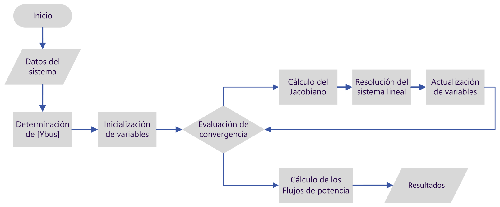

## Solución del problema de flujo de potencia con el método de Newton-Raphson

Keywords: `Power flow` `Newton-Raphson`

### Requerimientos

* Lectura de referencias a pie de página
* [Método de Newton-Raphson](https://www.geogebra.org/m/XCrwWHzy)

### Método de Newton-Raphson para la solución de sistemas de ecuaciones no lineales

El método de Newton-Raphson para la solución de sistemas de ecuaciones no lineales permite calcular una solución numérica para $\mathbf{f(x)=0}$ con $\mathbf{f(x)}:\mathbb{R}^n \rightarrow \mathbb{R}^n$.

Se parte de valores iniciales de $\mathbf{x}$ con los que $\mathbf{f(x)}\ne 0$ para llegar a un valor $\mathbf{x}$ tal que $\mathbf{f(x+\Delta x)=0}$ .

Se utiliza la serie de Taylor truncada en la primera derivada:

$$\mathbf{f(x+\Delta x)} \approx \mathbf{f(x)}+[J]\mathbf{\Delta x}+... =0$$

Luego, $\mathbf{f(x)}=-[J]\mathbf{\Delta x} \Rightarrow  \mathbf{\Delta x}=-[J]^{-1}\mathbf{f(x)}$

Donde $[J]$ es la matriz Jacobiana[^1] de $\mathbf{f(x)}$

El cálculo de las variables en una nueva iteración $r$ se hace de la siguiente manera:

$$\mathbf{x}^{(r)}=\mathbf{x}^{(r-1)}+\mathbf{\Delta x}^{(r-1)}=\mathbf{x}^{(r-1)}-[J^{(r-1)}]^{-1}\mathbf{f(x)}^{(r-1)}$$

Donde:

$$\mathbf{x}=\begin{bmatrix} 
x_1\\
x_2\\
\vdots\\
x_n\\
\end{bmatrix}; \mathbf{f(x)}= \begin{bmatrix} 
f_1(x_1,x_2,...,x_n)\\
f_2(x_1,x_2,...,x_n)\\
\vdots\\
f_m((x_1,x_2,...,x_n)\\
\end{bmatrix}; \mathbf{[J]}=\begin{bmatrix} 
\frac{\partial f_1}{\partial x_1} & \frac{\partial f_1}{\partial x_2} & ... & \frac{\partial f_1}{\partial x_n} \\
\frac{\partial f_2}{\partial x_1} & \frac{\partial f_2}{\partial x_2} & ... & \frac{\partial f_2}{\partial x_n} \\
\vdots & \vdots & \ddots & \vdots\\
\frac{\partial f_n}{\partial x_1} & \frac{\partial f_n}{\partial x_2} & ... & \frac{\partial f_n}{\partial x_n} \\ 
\end{bmatrix} $$

### Formulación del método de Newton-Raphson para la solución de flujos de potencia

Recordemos que el problema de flujo de potencia está dado por las ecuaciones de inyección de potencia a cada uno de los nodos del sistema. Para resolver este sistema de ecuaciones simultáneo, se puede aplicar el método de Newton-Raphson teniendo en cuenta que:

$$\mathbf{f(x)}= \begin{bmatrix} 
\mathbf{\Delta P} \\
--\\
\mathbf{\Delta Q} \\
\end{bmatrix}; \begin{matrix}
\Delta P_i=P_{esp,i}-P_i \\
\Delta Q_j=Q_{esp,j}-Q_j \\
\end{matrix} $$

Donde $\Delta P_{esp,i}$ es la potencia activa especificada o conocida para los nodos de generación y de carga, mientras que $\Delta Q_{esp,j}$ es la potencia reactiva especificada o conocida para los nodos de carga. Estas son las variables conocidas de potencia de todos los nodos.

Además, las variables del sistema de ecuaciones son:

$$ \mathbf{x}= \begin{bmatrix}
\mathbf{\delta}\\
--\\
\mathbf{V}\\
\end{bmatrix}$$

Donde $\delta_i$ son los ángulos de los nodos de generación y de carga, mientras $V_j$ son las magnitudes de voltaje de los nodos de carga. Es decir, las variables desconocidas de los voltajes de todos los nodos.

Entonces, las funciones que se resuelven buscan lograr que la diferencia entre los valores de potencia conocidos en los nodos sea prácticamente igual a la potencia calculada en los nodos. Estas diferencias deben ser menores a una tolerancia que se representa por $\Epsilon$. Comúnmente, esta tolerancia es muy pequeña, por debajo de $10^{-4}$.

Aplicando el método de Newton-Raphson, tenemos que $-\mathbf{f(x)}=[J]\mathbf{\Delta x}$, pero con la definición dada para $\mathbf{f(x)}$:

$$\mathbf{-f(x)}= \begin{bmatrix} 
-\mathbf{\Delta P} \\
--\\
-\mathbf{\Delta Q} \\
\end{bmatrix} = \begin{bmatrix}
\frac{\partial \Delta P_i}{\partial \delta_i} | \frac{\partial \Delta P_i}{\partial V_j} \\
--\\
\frac{\partial \Delta Q_j}{\partial \delta_i} | \frac{\partial \Delta Q_j}{\partial V_j} \\
\end{bmatrix} \begin{bmatrix}
\Delta \delta_i\\
\Delta V_j
\end{bmatrix}$$

Donde $i$ son los índices de los nodos de carga y de generación, mientras que $j$ representa los índices de los nodos de carga. 

Para mejorar la simetría numérica de la matriz jacobiana, se reformula el sistema usando como variable $\frac{\Delta V_j}{V_j}$ en vez de $\Delta V_j$. Además, se sabe que $\frac{\partial \Delta P_i}{\partial x_i}=-\frac{\partial P_i}{\partial x_i}$ y de la misma manera $\frac{\partial \Delta Q_j}{\partial x_i}=-\frac{\partial Q_j}{\partial x_i}$, por lo tanto:

$$\begin{bmatrix} 
\mathbf{\Delta P} \\
--\\
\mathbf{\Delta Q} \\
\end{bmatrix} = \begin{bmatrix}
\frac{\partial P_i}{\partial \delta_i} | V_j \frac{\partial P_i}{\partial V_j} \\
--\\
\frac{\partial Q_j}{\partial \delta_i} | V_j \frac{\partial Q_j}{\partial V_j} \\
\end{bmatrix} \begin{bmatrix}
\Delta \delta_i\\
\frac{\Delta V_j}{V_j}
\end{bmatrix}$$

Este sistema se puede escribir en forma resumida como:

$$\begin{bmatrix} 
\mathbf{\Delta P} \\
--\\
\mathbf{\Delta Q} \\
\end{bmatrix} = \begin{bmatrix}
H | N \\
--\\
M | L \\
\end{bmatrix} \begin{bmatrix}
\Delta \delta_i\\
\frac{\Delta V_j}{V_j}
\end{bmatrix}$$

Donde las submatrices del Jacobiano se pueden calcular usando las siguientes ecuaciones:

| Para $k\ne m$                                                                                             | Para $k=m$                 |
|:----------------------------------------------------------------------------------------------------------|:---------------------------|
| $H_{km}=\frac{\partial P_k}{\partial\delta_m}=V_k V_m (G_{km} \sin \delta_{km}-B_{km} \cos\delta_{km})$   | $H_{km}=-Q_k-B_{kk} V_k^2$ |
| $N_{km}=V_m \frac{\partial P_k}{\partial V_m}=V_k V_m (G_{km} \cos \delta_{km}+B_{km}  \sin \delta_{km})$ | $N_{km}=P_k+G_{kk} V_k^2$  |
| $M_{km}=\frac{\partial Q_k}{\partial\delta_m}=-V_k V_m (G_{km}  \cos \delta_{km}+B_{km} \sin \delta_{km}$ | $M_{km}=P_k-G_{kk} V_k^2$  |
| $L_{km}=V_m \frac{\partial Q_k}{\partial V_m}=V_k V_m (G_{km} \sin \delta_{km}-B_{km} \cos \delta_{km})$  | $L_{km}=Q_k-B_{kk} V_k^2$  |

Luego de definir las ecuaciones que conforman el núcleo del método de Newton-Raphson aplicado a la solución de flujos de potencia. Podemos establecer un algoritmo general para resolver el problema. En la siguiente figura se muestra un diagrama de flujo que sirve de guía para la implementación del método.

     

### Ejemplo

Se tiene una red de potencia de tres nodos cuyos datos están dados en valores por unidad calculados con base de potencia de $100 MVA$ y tensión igual a $100k V$.

En la siguiente figura se muestra el diagrama unifilar de la red, con las impedancias de las líneas de transmisión.

        

*Tabla de datos de nodos:*

| Nodos | Tipo de nodo | Tensión nominal (kV) | Potencia activa inyectada (MW) | Potencia reactiva inyectada (MVAr) | Magnitud de voltaje (p.u.) | Ángulo de voltaje (p.u.) |
|-------|--------------|----------------------|--------------------------------|------------------------------------|----------------------------|--------------------------|
| 1     | Referencia   | 100                  | --                             | --                                 | 1.02                       | 0.0                      |
| 2     | Generación   | 100                  | 50                             | --                                 | 1.02                       | 0.0                      |
| 3     | Carga        | 100                  | -100                           | -60                                | 1.02                       | 0.0                      |  

*Tabla de datos de los enlaces:*

| Identificador | Nodo desde | Nodo hacia | Resistencia (p.u.) | Reactancia (p.u.) | Admitancia en paralelo (p.u.) | $I_{max}$ (A) | 
|---------------|------------|------------|--------------------|-------------------|-------------------------------|---------------|
| 1             | 1          | 2          | 0,02               | 0,04              | 0                             | 150           |
| 2             | 1          | 3          | 0,02               | 0,06              | 0                             | 150           |
| 3             | 2          | 3          | 0,01               | 0,02              | 0                             | 200           |

 En este [enlace](EjemploNR.ipynb), encontrarás un código sencillo en Python para resolver el ejemplo usando la formulación del método de Newton-Raphson.

### Control de versiones

| Versión    | Descripción        | Autor                                       | Horas |
|------------|:-------------------|---------------------------------------------|:-----:|
| 2023.07.27 | Versión preliminar | [josimardtm](https://github.com/josimardtm) |   8   |

_PowerFlow es de uso libre para fines académicos, conoce nuestra licencia, cláusulas, condiciones de uso y como referenciar los contenidos publicados en este repositorio, dando [clic aquí](../../LICENSE.md)._

_¿Encontraste útil este repositorio? Apoya su difusión marcando este repositorio con una ⭐ o síguenos dando clic en el botón Follow de [Josimardtm](https://github.com/josimardtm) en GitHub._

| [Anterior](../Readme.md) | [:house: Inicio](../../README.md) | [:beginner: Ayuda / Colabora](https://github.com/josimardtm/PowerFlow/discussions) | [Siguiente](../01.02.Classification/Readme.md) |
|--------------------------|-----------------------------------|------------------------------------------------------------------------------------|------------------------------------------------|

[^1]:[Matriz Jacobiana](https://es.khanacademy.org/math/multivariable-calculus/multivariable-derivatives/jacobian/v/the-jacobian-matrix)

    

